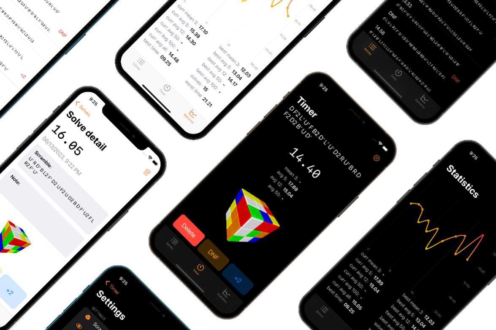

# Speed Cubing Timer

Speed Cube Timer is an application used for practicing speedcubing. It can generate scrambles, measure times and calculate and visualize statistics.

# 🦾 Features

- Track your time
- Generate and visualize scrambles
- View statistics on current and best averages with chart
- Use inspection time to enhance your solving experience
- Use dark and light mode
- View time in live activities (including dynamic island)

# 👨‍💻 Technologies, APIs, Frameworks, and Architecture

- Swift UI for interfaces
- UIKit for navigation
- Swift UI Charts
- Scene Kit for 3D rendering
- Core Data for data persistence
- Activity Kit for live activities
- XCTest for testing
- MVVC architecture
- Dependency Injection for maintainability

# ✅ Future Improvements

- Support for multiple puzzles
- Multiple sessions for better organization
- CloudKit integration for cloud storage

